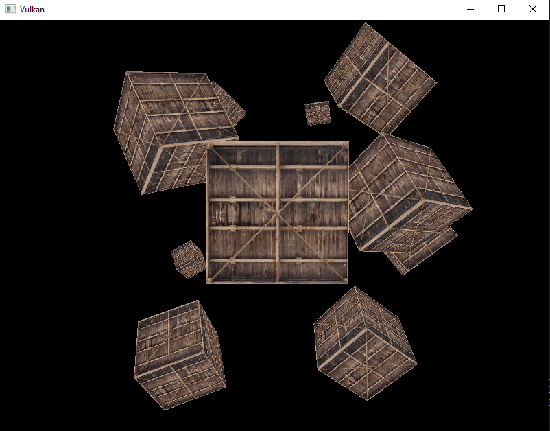

RU: Проект для изучения графического Vulkan API. 
Результат - рендер десяти текстурированных кубов, с использованием свободно летающей камеры, аналогично завершеющему туториал LearnOpenGL разделу "Getting Started".
Проект представлен на двух языках программирования: чистом Си и С++

ENG: A project to explore the graphical Vulkan API. 
The result is a rendering of ten textured cubes using a free-flying camera, similar to the "Getting Started" section of the LearnOpenGL tutorial.
The project is presented in two programming languages: pure C and C++

